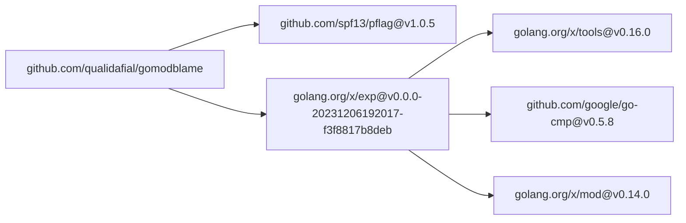

# gomodblame

Generate Mermaid graph to visualize how go mod dependencies are
being brought in.

## Installation

```shell
go install github.com/qualidafial/gomodblame@latest
```

## Usage

```shell
gomodblame -o graph.mermaid
```

## Example Output

```
graph LR;
    n0["github.com/qualidafial/gomodblame"];
    n1["github.com/spf13/pflag@v1.0.5"];
    n0 --> n1;
    n2["golang.org/x/exp@v0.0.0-20231206192017-f3f8817b8deb"];
    n0 --> n2;
    n3["github.com/google/go-cmp@v0.5.8"];
    n2 --> n3;
    n4["golang.org/x/mod@v0.14.0"];
    n2 --> n4;
    n5["golang.org/x/tools@v0.16.0"];
    n2 --> n5;
```

