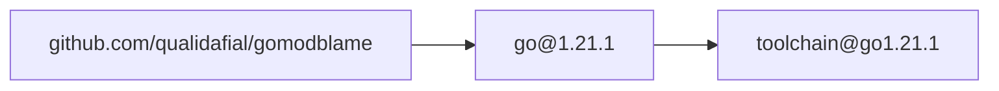

# gomodblame

Generate Mermaid graph to visualize how go mod dependencies are
being brought in.

## Installation

```shell
go install github.com/qualidafial/gomodblame@latest
```

## Usage

```shell
gomodblame toolchain > graph.mermaid
```

## Example Output

